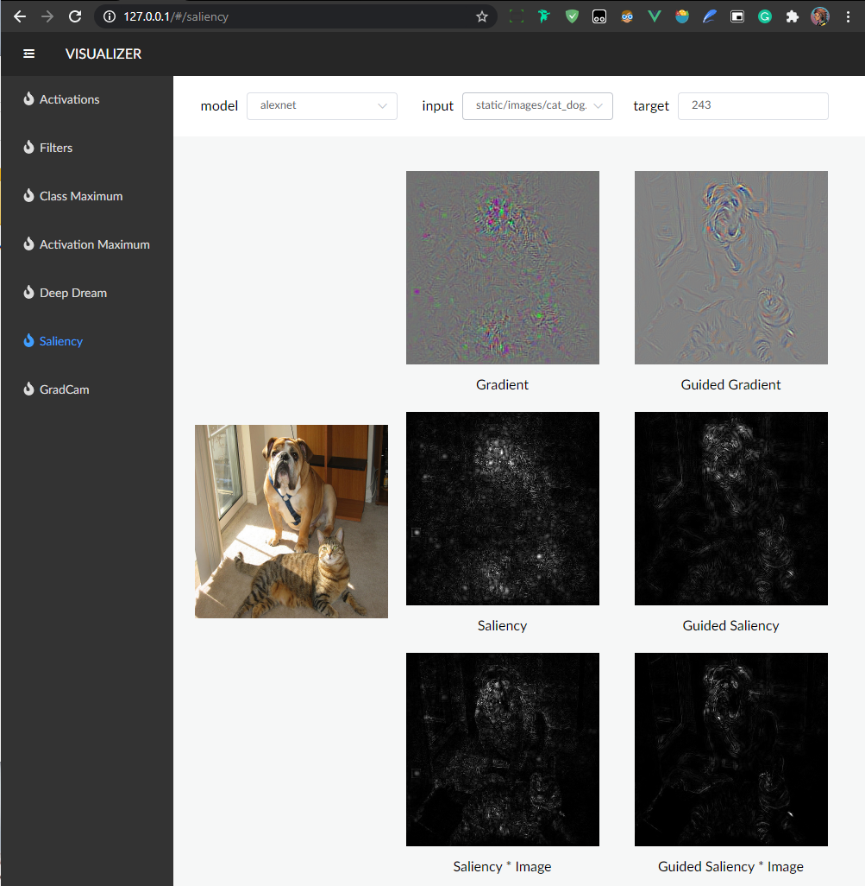

# Visualizer



## TODO

- [x] Activations
- [x] Filters
- [x] Class maximum
- [x] Guided backpropagation
- [x] Saliency Maps
- [x] SmoothGrad
- [x] GradCAM
- [ ] IntergratedGradients

## usage

```shell
# build frontend
cd frontend
npm install
npm run build
```

```shell
# run server
cd nn-viser
python run.py
```

* Running on http://127.0.0.1:5000/
